<div align="center">
  

  <br />

  <h3>🌐 Acesse o Projeto: <a href="https://autonomax.vercel.app" target="_blank">www.autonomax.vercel.app</a></h3>

  [](https://dotnet.microsoft.com/)
  [](https://reactjs.org/)
  [](https://railway.app/)
  [](https://supabase.com/)
  [](https://vercel.com/)
  [](https://www.postgresql.org/)
</div>


# 🚀 Autonomax - Gestão de Fluxo Inteligente para Autônomos

O **Autonomax** é uma plataforma robusta desenvolvida para auxiliar profissionais autônomos na gestão financeira e controle de parceiros. Focado em simplicidade e eficiência, o sistema permite o acompanhamento em tempo real de receitas, despesas e métricas de retenção de clientes.

---

## 📸 Demonstração do Sistema

### 💻 Interface Desktop
Principais telas da aplicação web focadas em análise de dados e gestão centralizada.

| Analítico Principal | Detalhes do Cliente | Histórico de Fluxo | Detalhes Financeiros |
| :---: | :---: | :---: | :---: |
| 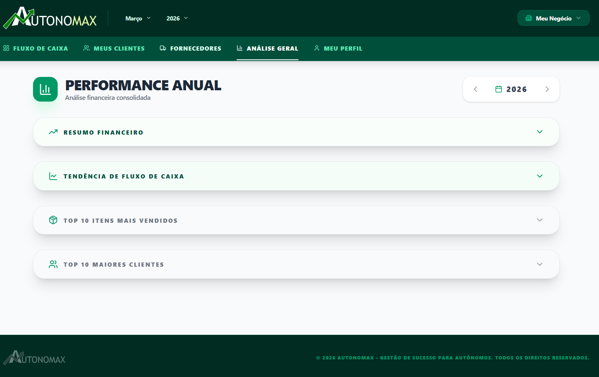 | 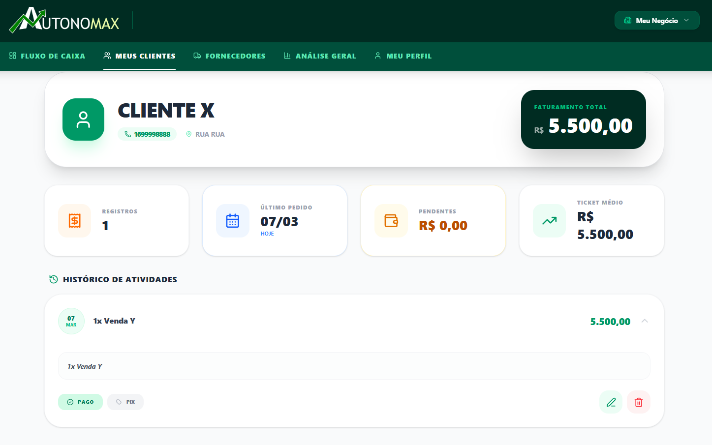 | 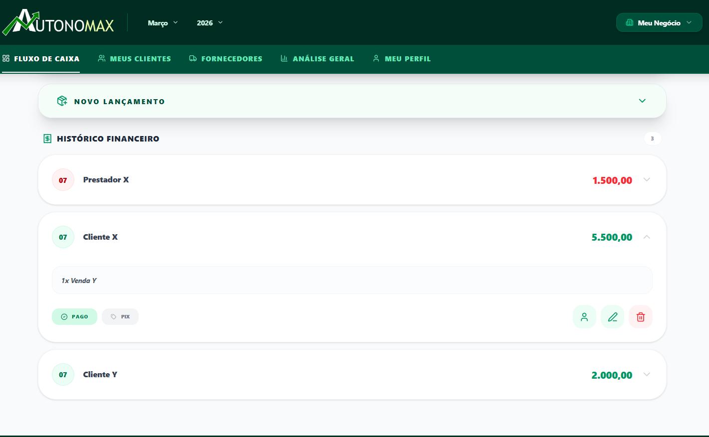 | 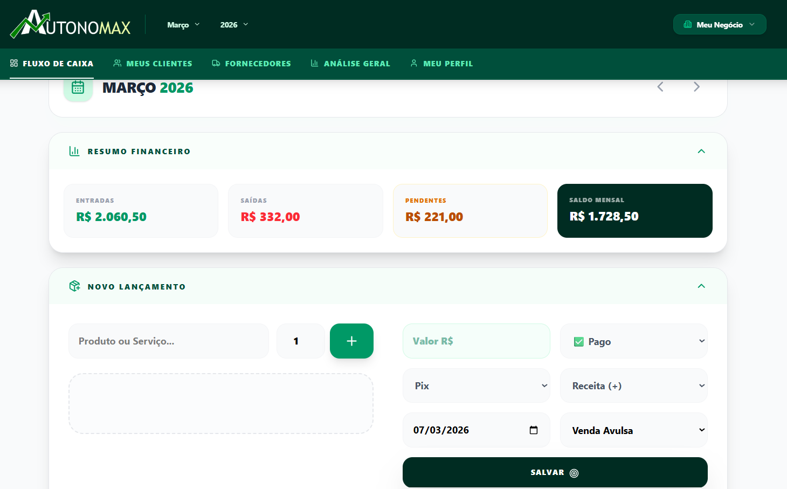 |

| Login do Sistema | Gestão de Clientes | Gestão de Parceiros | Perfil do Usuário |
| :---: | :---: | :---: | :---: |
|  | 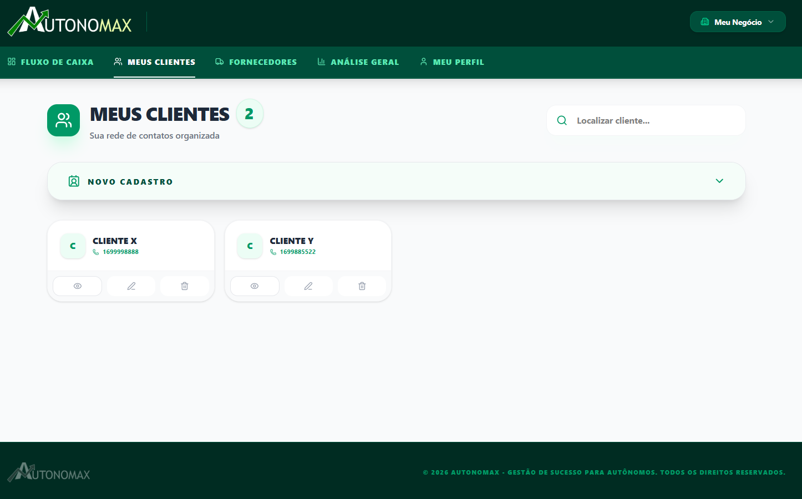 | 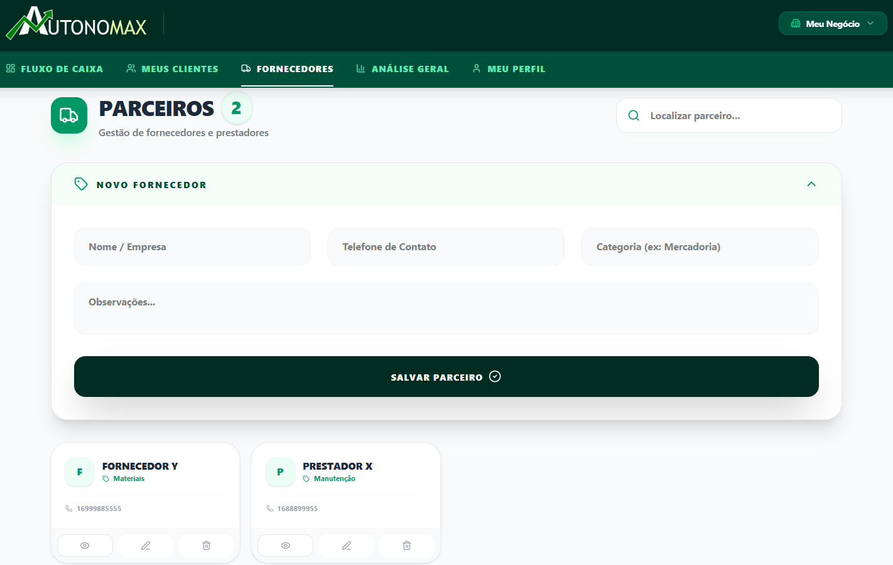 | 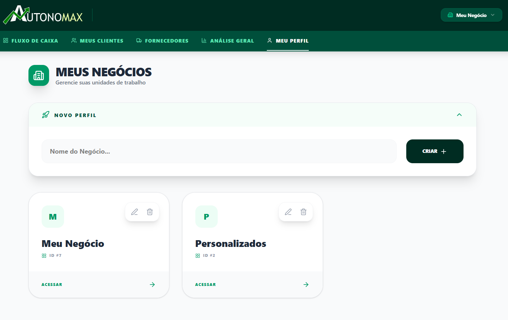 |

---

### 📱 Experiência Mobile
Interface responsiva otimizada para o acompanhamento rápido no dia a dia, organizada para visualização ágil.

| Login Inicial | Menu Lateral | Dashboard Total | Gráficos Analíticos |
| :---: | :---: | :---: | :---: |
|  | 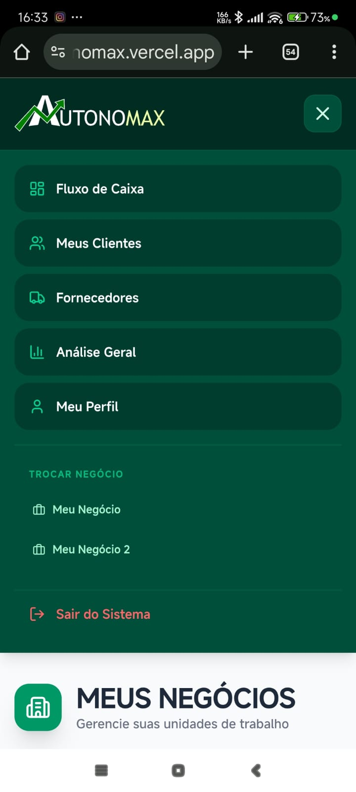 | 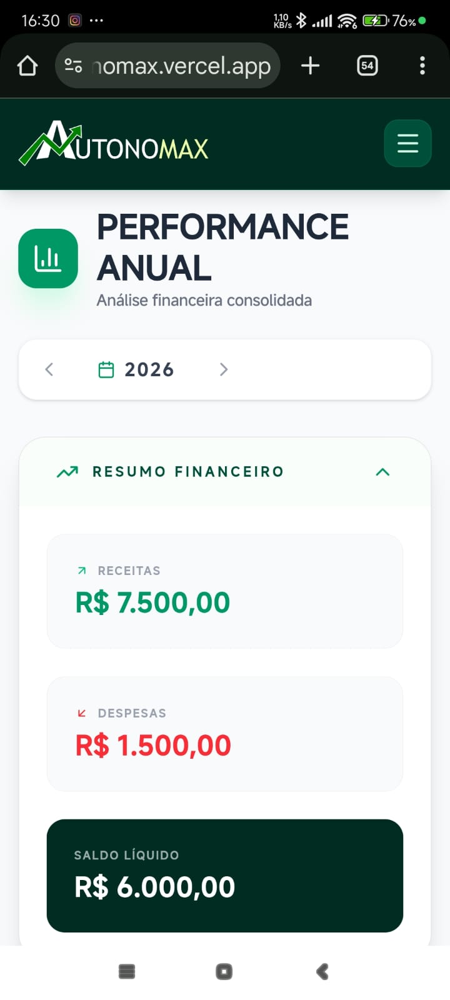 | 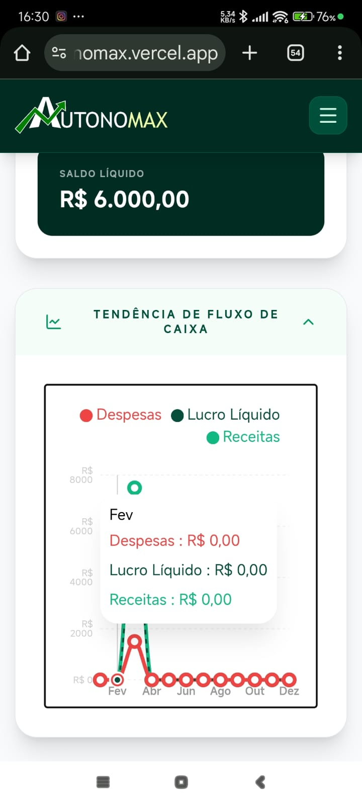 |

| Top Desempenho | Histórico Geral | Lista de Clientes | Novo Lançamento |
| :---: | :---: | :---: | :---: |
| 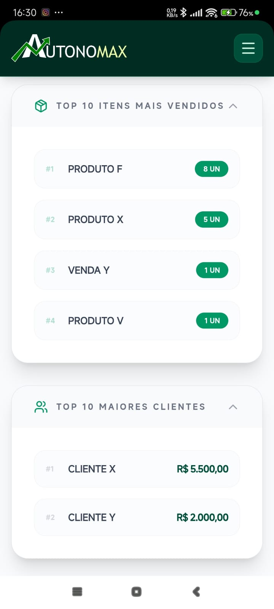 | 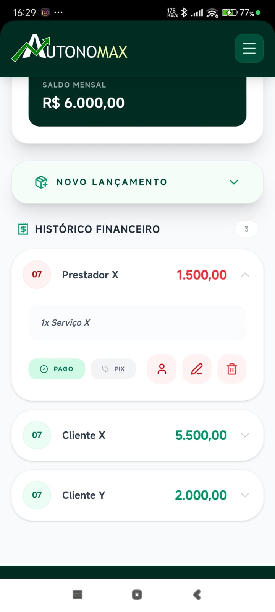 |  | 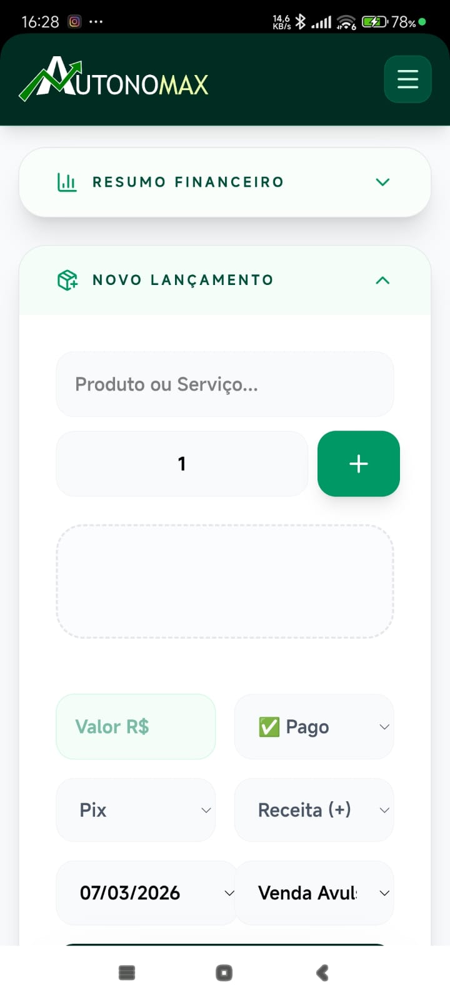 |

| Fluxo de Caixa | Meus Negócios | Perfil Profissional | Dados Pessoais |
| :---: | :---: | :---: | :---: |
| 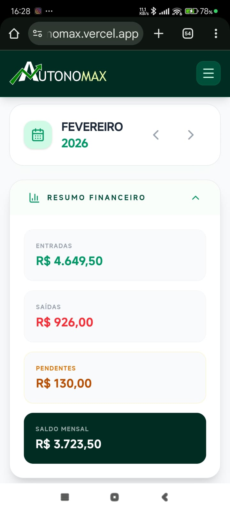 |  |  | 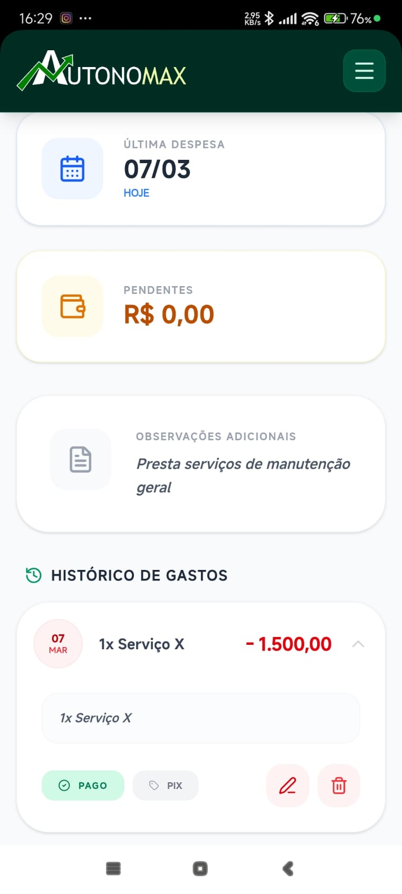 |

---


## 💎 Diferenciais Técnicos

* **Arquitetura de Dados:** Implementação de **DTOs (Data Transfer Objects)** para garantir o desacoplamento das entidades do banco e otimizar a serialização JSON, eliminando problemas de referências cíclicas.
* **Segurança Robusta:** Sistema de autenticação **JWT (JSON Web Token)** com criptografia **BCrypt** para proteção de senhas e *Rate Limiting* nativo para prevenção de ataques de força bruta.
* **Persistência e Performance:** Uso de **Entity Framework Core 9** com PostgreSQL (via Supabase), utilizando índices e restrições de integridade referencial para garantir a consistência absoluta dos dados.
* **UX/UI Reativa:** Frontend SPA desenvolvido com **React + Vite**, priorizando performance, consumo eficiente de APIs via **Axios Interceptors** e design responsivo com **Tailwind CSS**.

## 🧪 Qualidade e Segurança
* **Testes de Autenticação**: Validação de Login, Registro e prevenção de enumeração de usuários.
* **Auditoria**: Logs de segurança para tentativas de acesso inválidas.
* **Code Coverage**: Cobertura de código para garantir a integridade financeira.
* **xUnit**: Camada de testes automatizados para autenticação e segurança

## 🛠️ Funcionalidades Atuais

* **Gestão Multi-Negócio:** Permite que o usuário gerencie diferentes frentes de trabalho ou empresas de forma isolada dentro da mesma conta.
* **Fluxo de Caixa Dinâmico:** Registro de entradas e saídas com categorização por mês e ano, permitindo uma navegação histórica intuitiva.
* **Dashboard Inteligente:** Visualização imediata de Saldo Total, Receitas e Despesas do período selecionado.
* **Gestão de Clientes:** Cadastro e vínculo de clientes às transações de receita para análise de faturamento por origem.
* **Filtros por Período:** Motor de busca otimizado no backend para recuperar lançamentos financeiros baseados em competência mensal.

## 🚀 Roadmap (Próximas Features)

* **Relatórios Exportáveis:** Geração de arquivos PDF e Excel.
* **Gráficos Avançados:** Implementação de gráficos de linha e pizza (Recharts) para análise de tendência de gastos e fontes de receita.
* **Metas Financeiras:** Ferramenta para definição de objetivos de faturamento mensal com barra de progresso em tempo real.
* **Notificações Push:** Alertas para contas a pagar e lembretes de faturamento para clientes inadimplentes.
* **App Mobile:** Versão nativa utilizando React Native para gestão financeira "on-the-go".

---

## 🛠️ Stack Tecnológica

### **Backend (Core Engine)**
* **Runtime:** .NET 9 (C#)
* **ORM:** Entity Framework Core (Code First)
* **Database:** PostgreSQL (Supabase)
* **API Documentation:** Swagger UI (OpenAPI 3.0)

### **Frontend (Interface)**
* **Framework:** React 18+ com TypeScript
* **Estilização:** Tailwind CSS
* **Ícones:** Lucide React
* **Navegação:** React Router Dom

---

## ⚙️ Configuração do Ambiente de Desenvolvimento

### **Backend**
1. Navegue até o diretório raiz do servidor: `cd Autonomax.Backend`
2. Configure a `Connection String` no arquivo `appsettings.Development.json`.
3. Instale as dependências e execute as migrations:
   ```bash
   dotnet restore
   dotnet ef database update
   ```
4. Inicie a API: 
```bash
dotnet run
```
(Disponível em: http://localhost:5203)

### **Frontend**
1. Navegue até a pasta: cd Autonomax.Frontend
2. Instale as dependências: 
```bash
npm install
```
3. Inicie o servidor: 
```bash
npm run dev 
```
(Disponível em: http://localhost:5173)

### 👤 Autor
## Allison - Desenvolvedor Full Stack
